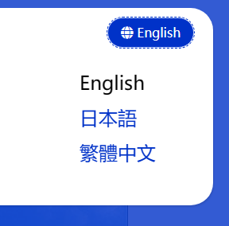

# MVCウェブサイト開発の基礎

このドキュメントでは、Dignite Cmsに基づくMVCウェブサイトの開発の基本的な知識を紹介します。

## 公開アプリケーション層

### IFieldPublicAppService

#### API

- `Task<FieldDto> FindByNameAsync(string name)`:

    名前によってフィールドを検索します。見つかった場合はフィールド情報を返し、それ以外の場合は `null` を返します。

#### `FieldDto` のプロパティ

- `Id`: フィールドの一意の識別子です。
- `Name`: フィールドの一意の名前です。
- `DisplayName`: フィールドの表示名です。
- `Description`: フィールドの説明です。
- `FormControlName`: フィールドコントロールの名前です。
- `FormConfiguration`: フィールドコントロールの構成です。

### ISitePublicAppService

#### API

- `Task<SiteDto> FindByNameAsync(string name)`:

    名前によってサイトを検索します。見つかった場合はサイト情報を返し、それ以外の場合は `null` を返します。

- `Task<SiteDto> FindByHostAsync(string host)`:

    ホストアドレスによってサイトを検索します。見つかった場合はサイト情報を返し、それ以外の場合は `null` を返します。

#### `SiteDto` のプロパティ

- `Id`: サイトの一意の識別子です。
- `Name`: サイトの一意の名前です。
- `DisplayName`: サイトの表示名です。
- `Host`: サイトのホストアドレスです。例: `https://localhost:44339`。
- `IsActive`: サイトがアクティブかどうかを示します。
- `Languages`: サイトでサポートされている言語のリストです。

#### `SiteDto` の拡張メソッド

- `SiteLanguageDto GetDefaultLanguage()`: サイトのデフォルトの言語を取得します。
- `bool LanguageCultureExists(string culture)`: 指定された言語のカルチャが有効かどうかをチェックします。

### ISectionPublicAppService

#### API

- `Task<SectionDto> GetAsync(Guid id)`:

    IDによってセクション情報を取得します。見つかった場合はセクション情報を返し、それ以外の場合は例外をスローします。

- `Task<SectionDto> FindByNameAsync(Guid siteId, string name)`:

    名前とサイトIDによってセクションを検索します。見つかった場合はセクション情報を返し、それ以外の場合は `null` を返します。

- `Task<SectionDto> FindByEntryPathAsync(Guid siteId, string entryPath)`:

    エントリパス（つまり、エントリのURLと一致する）とサイトIDによってセクションを検索します。見つかった場合はセクション情報を返し、それ以外の場合は `null` を返します。

- `Task<SectionDto> GetDefaultAsync(Guid siteId)`:

    指定されたサイトのデフォルトセクションを取得します。

#### `SectionDto` のプロパティ

- `Id`: セクションの一意の識別子です。
- `Name`: セクションの一意の名前です。
- `DisplayName`: セクションの表示名です。
- `IsActive`: セクションがアクティブかどうかを示します。
- `Type`: セクションのタイプ（詳細については [Sections](basic-concept.md#sections) を参照してください）。
- `SiteId`: セクションが属するサイトの一意の識別子です。
- `Site`: セクションが属するサイトのDTOです。
- `Route`: セクションの下のエントリのURLルートです。
- `Template`: エントリを表示するためのビューテンプレートです。
- `EntryTypes`: セクション内のエントリタイプのリストです。

#### `SectionDto` の

拡張メソッド

- `FieldDto GetField(Guid entryTypeId, string name)`: 指定された名前のフィールドを取得します。

### IEntryPublicAppService

#### API

- `Task<EntryDto> FindBySlugAsync(FindBySlugInput input)`:

    スラッグによってエントリを検索します。見つかった場合はエントリ情報を返し、それ以外の場合は `null` を返します。

    `input` パラメータには、次の3つのクエリ条件が含まれます：
  - `SectionId`: セクションID（必須）。
  - `Slug`: エントリのスラッグ（必須）。
  - `Culture`: エントリのカルチャ。デフォルト値はサイトのデフォルト言語です。

- `Task<EntryDto> GetAsync(Guid id)`:

    IDによってエントリを取得します。見つかった場合はエントリ情報を返し、それ以外の場合は例外をスローします。

- `Task<EntryDto> FindPrevAsync(Guid id)`:

    指定された `id` より前に公開された前のエントリを検索します。見つかった場合はエントリ情報を返し、それ以外の場合は `null` を返します。

- `Task<EntryDto> FindNextAsync(Guid id)`:

    指定された `id` より後に公開された次のエントリを検索します。見つかった場合はエントリ情報を返し、それ以外の場合は `null` を返します。

- `Task<PagedResultDto<EntryDto>> GetListAsync(GetEntriesInput input)`:

    指定された条件を満たすエントリのリストを取得します。

    `input` パラメータには、次のクエリ条件が含まれます：
  - `SectionId`: セクションID（必須）。
  - `Culture`: エントリのカルチャ。デフォルト値はサイトのデフォルト言語です。
  - `EntryTypeId`: エントリタイプID。
  - `CreatorId`: 作成者のID。
  - `StartPublishDate`: 開始公開日。
  - `ExpiryPublishDate`: 有効期限公開日。
  - `Filter`: エントリタイトルのフィルタ文字列。
  - `QueryingByFieldsJson`: フィールド値によるエントリのクエリ（詳細については [Advanced Development](advanced-development.md#querying-entries-by-field-values) を参照してください）。

  上記の条件に基づいてエントリをクエリするだけでなく、エントリID配列でリストをクエリすることもサポートされています：
  - `SectionId`: 指定されたセクションID（必須）。
  - `EntryIds`: 指定されたエントリIDまたはID。

#### `EntryDto` のプロパティ

- `Id`: エントリの一意の識別子です。
- `CreatorId`: 作成者の一意の識別子です。
- `SectionId`: エントリが所属するセクションの一意の識別子です。
- `EntryTypeId`: エントリのタイプの一意の識別子です。
- `Culture`: エントリの文化的な領域です。
- `Title`: エントリのタイトルです。
- `Slug`: エントリのスラッグです。
- `ParentId`: 親エントリの一意の識別子です。
- `Order`: セクション内のエントリの順序です。
- `Status`: エントリの公開状態です。`Draft` および `Published` を含みます。
- `PublishTime`: エントリの公開時刻です。
- `IsActivatedVersion`: エントリのアクティブ化バージョンであるかどうかを示します。

#### `EntryDto` の拡張メソッド

- `GetUrl(SectionDto section)`: エントリのURLを取得します。

## MVCコントローラ

### EntryController

`EntryController` には、次のアクションが含まれています：

- `HomePage()`

  デフォルトセクションのスラッグ `Index` に一致するエントリを検索し、 `EntryViewModel` ビューモデルをテンプレートページに渡します。

  たとえば、[クイックスタート](quick-start.md) の `Home Page` セクションでは、 `https://localhost:44339` にアクセスすると、 `Home Page` セクションの下の言語が `en` でスラッグが `index` のエントリが取得され、 `/Views/Entry/HomePage.cshtml` ビューを使用してページがレンダリングされます。

- `EntryPageWithCulture(string culture, string entryPath)`

  指定された `Culture` と一致する `entryPath` 値のエントリを検索し、 `EntryViewModel` ビューモデルをテンプレートページに渡します。

  たとえば、[クイックスタート](quick-start.md) の `Blog Post` セクションでは、 `https://localhost:44339/ja/blog/2024/03/first-blog-post` にアクセスすると、言語が `ja` でスラッグが `first-blog-post` のエントリが取得され、 `Entry/Blog/Entry.cshtml` ビューを使用してページがレンダリングされます。

- `EntryPage(string entryPath)`

  一致する `entryPath` 値のエント

リを検索し、 `EntryViewModel` ビューモデルをテンプレートページに渡します。

  たとえば、[クイックスタート](quick-start.md) の `Blog Home` セクションでは、 `https://localhost:44339/blog` にアクセスすると、言語が `en` でスラッグが `index` のエントリが取得され、 `Entry/Blog/Index.cshtml` ビューを使用してページがレンダリングされます。

`EntryViewModel` クラスには、次の2つのプロパティが含まれています：

- `Entry`: `EntryDto` 型のエントリです。
- `Section`: `SectionDto` 型のセクションです。

## ローカライゼーション

Dignite Cms Mvcウェブサイトは、テナントごとに独立したローカライゼーションをサポートしています。ローカライゼーションリソースを格納するために `CmsPublicWebResource.{culture}.json` ファイルを使用します。

テナントのローカライゼーションリソースファイルは、 `/Tenants/{TenantName}/Localization/` ディレクトリに格納されています：


マルチテナントローカライゼーション機能の使用方法についての情報については、[マルチテナントローカライゼーション](https://learn.dignite.com/zh-Hans/abp/latest/Localization-MultiTenancy) ドキュメントを参照してください。

## ビューコンポーネント

### ローカライゼーションスイッチコンポーネント

`CultureSwitchViewComponent` コンポーネントは、ローカライゼーションを切り替えるために使用されます。



`IToolbarContributor` インターフェースを実装するクラスを作成し、次のコードを追加します：

```csharp
public class CmsWebHostToolbarContributor : IToolbarContributor
{
    public virtual Task ConfigureToolbarAsync(IToolbarConfigurationContext context)
    {
        if (context.Toolbar.Name != StandardToolbars.Main)
        {
            return Task.CompletedTask;
        }

        context.Toolbar.Items.Add(new ToolbarItem(typeof(CultureSwitchViewComponent)));

        return Task.CompletedTask;
    }
}
```

モジュールクラスの `ConfigureServices` メソッドに次のコードを追加します：

```csharp
Configure<AbpToolbarOptions>(options =>
{
    options.Contributors.Add(new CmsWebHostToolbarContributor());
});
```
