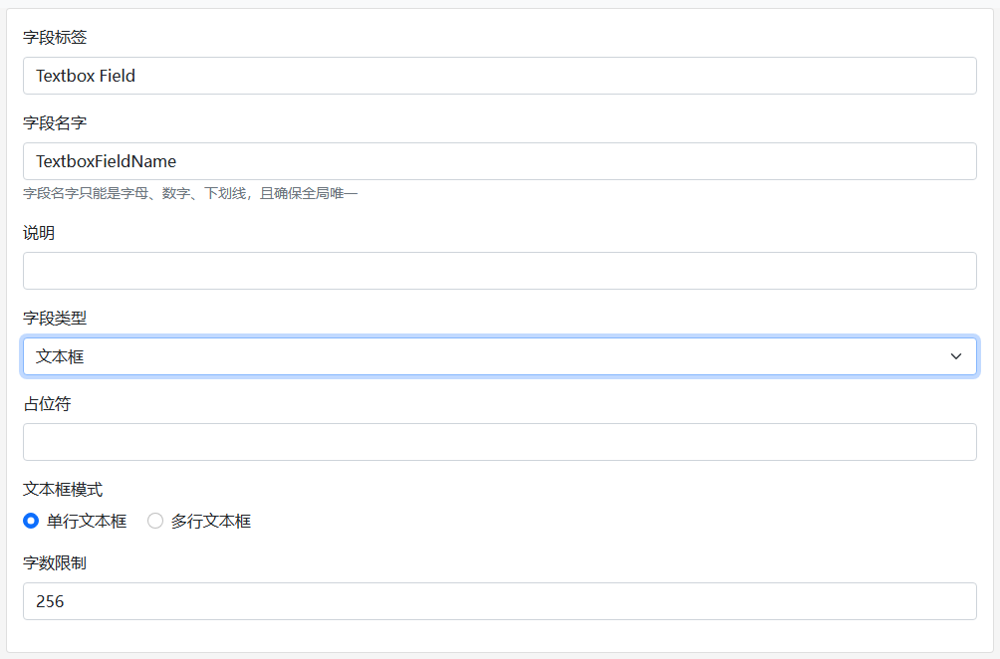
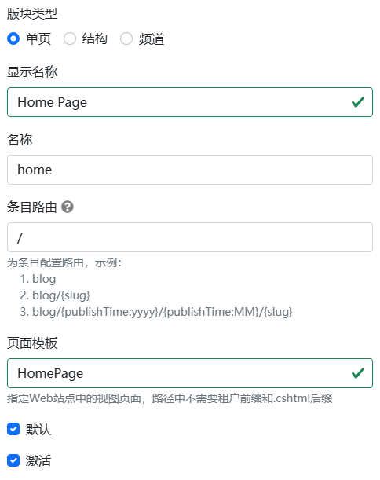

# Dignite Cms基本概念解析

## 字段

字段是Dignite Abp中的[动态表单](https://learn.dignite.com/zh-Hans/abp/latest/Dynamic-Forms)实现，通过不同类型的字段和配置，满足各种页面展示需求。

**文本编辑字段示例：**

通用属性：

- 字段标签：字段的显示文本
- 字段名称：字段的唯一标识符
- 字段说明：字段的描述文本
- 字段类型：支持文本框、下拉菜单、富文本编辑、日期选择、文件上传、数字框等类型表单

文本编辑字段的配置：

- 文本编辑表单的占位符：在用户输入文本前，在文本框内显示的文本
- 文本编辑表单的模式：包括单行文本框和多行文本框两种模式
- 文本编辑表单的字数限制：限制用户输入文字的最大数量

### 高级表单

除了通用类型的动态表单外，Dignite Cms还提供了三种高级表单类型：

- 条目选择：配置条目列表的数据源，供用户选择条目
- 矩阵：通过配置矩阵块，实现丰富的结构化内容管理
- 表格：通过配置表格头，规范用户输入的数据

> 欲了解更多关于表单的使用，请查看快速入门教程以启动Dignite Cms Blazor WebAssembly，并在后台管理中体验。

## 站点

站点即网站，用于配置一个网站的可访问特征。

Dignite Cms支持多站点特性，满足二级域名或多域名站点的应用。

- 显示名称：站点的显示文本
- 名称：站点的唯一标识符
- 主机地址：网站的域名地址，在整个系统中具有唯一性
- 是否激活：开启或禁止用户对网站的访问
- 语言：选择网站内容支持的语言

## 版块

版块是一个网站的骨架，用于将网站内容分区、分块。

- 版块类型：包括单页类型、结构类型和频道类型三种类型
  
  - 单页类型：每个版块中同一条目类型的条目有且只能有一条，用于网站首页、产品索引页、博客首页等
  - 结构类型：适用于开发者预知该类型下的条目数量不会太多，并且需要支持手动排序或多层级结构，比如常见问题解答、服务项目等
  - 频道类型：适用于不断发布新内容的场景，支持无限增加条目，比如博客、新闻等

- 显示名称：版块的显示文本
- 名称：版块名称在同一站点下具备唯一性
- 条目路由：根据不同类型的版块，可以设置不同的条目路由规则
- 页面模板：用于展示条目的视图页面路径，不需要包含.cshtml后缀
- 默认：指定网站访问时的默认版块，仅适用于单页类型版块
- 激活：开启或禁止用户对该版块的访问
  
## 条目类型

版块中的条目可以以多种形式存在，比如博客版块的帖子可以是图文、视频或者画廊形式。每一种类型都可以配置不同的字段，满足前端UI需求。

- 显示名称：条目类型的显示文本
- 名称：条目类型名称在同一版块下具备唯一性
- 字段布局：字段可以分布在多个Tab中布局，并且支持设置字段标签、是否必填以及是否加入列表
- 高级表单：支持条目选择、矩阵和表格等高级表单类型

## 条目

条目是网站页面中的内容，条目的数据由字段构成。

条目隶属于某个版块，支持多语言和多版本特性。

- 标题：每个条目都具有一个标题
- 表单字段：由条目类型中定义的字段组成
- 别名：每个条目在版块中具备唯一性
- 语言：条目的语言由站点语言列表配置
- 发布时间：默认为条目的当前时间，支持手动修改发布时间
- 版本：支持多版本功能，每个条目可以创建多个版本，但只有一个激活版本
- 修订说明：记录编辑条目时的说明
