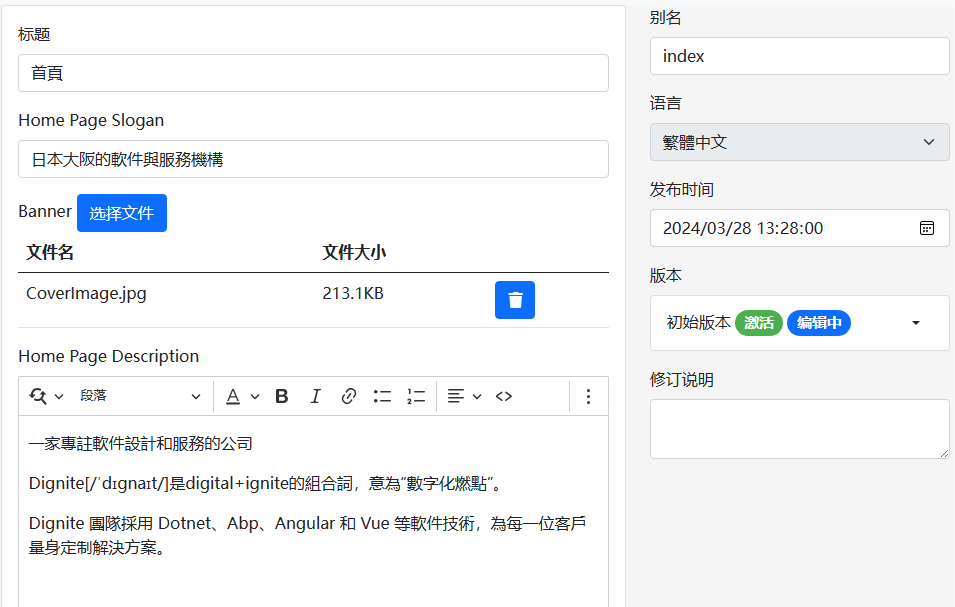

# Dignite Cms后台系统启动指南

Dignite Cms的后台系统基于Blazor技术，提供了Blazor WebAssembly和Blazor Server两种运行模式。以下是启动后台系统的详细步骤：

````json
//[doc-params]
{
    "UI": ["Blazor","BlazorServer"]
}
````

{{if UI == "Blazor"}}

## 使用Blazor WebAssembly方式启动

1. **启动IdentityServer**

    在终端中，进入`host\Dignite.Cms.IdentityServer`目录，并执行以下命令：

    ```bash
    dotnet ef database update
    ```

    ```bash
    dotnet run
    ```

2. **启动HttpApi.Host**

    在终端中，进入`host\Dignite.Cms.HttpApi.Host`目录，并执行以下命令：

    ```bash
    dotnet ef database update
    ```

    ```bash
    dotnet run
    ```

    > 第一次运行时，系统将自动创建种子数据。

3. **启动Blazor.Host**

    在终端中，进入`host\Dignite.Cms.Blazor.Host`目录，并执行以下命令：

    ```bash
    dotnet run
    ````

    在浏览器中访问`https://localhost:44307`地址即可进入Dignite Cms后台。

    > 初始账号： admin
    >
    > 初始密码： 1q2w3E*

4. **启动MVC网站**

    在终端中，进入`host\Dignite.Cms.Web.Host`目录，并执行以下命令：

    ```bash
    dotnet run
    ```

    在浏览器中访问`https://localhost:44339`地址即可进入Dignite Cms MVC网站。

{{end}}

{{if UI == "BlazorServer"}}

## 使用Blazor Server方式启动

在终端中，进入`host\Dignite.Cms.Blazor.Server.Host`目录，并执行以下命令：

```bash
dotnet ef database update
```

```bash
dotnet run
```

在浏览器中访问`https://localhost:44361`地址即可进入Dignite Cms后台。

{{end}}

## 功能概览

### 字段管理

字段用于定义条目的属性，系统预设了一些字段方便使用。


### 站点管理

站点用于配置网站的可访问特征，系统自动创建了一个站点，支持多语言。


### 版块管理

版块是站点的骨架，用于支撑条目的结构布局，系统自动创建了一些常用版块。


### 条目类型管理

条目类型用于定义版块下条目应用哪些字段，每个版块可以配置多个条目类型。


### 条目管理

条目是网站中各个版块的内容，支持多语言和多版本特性。


